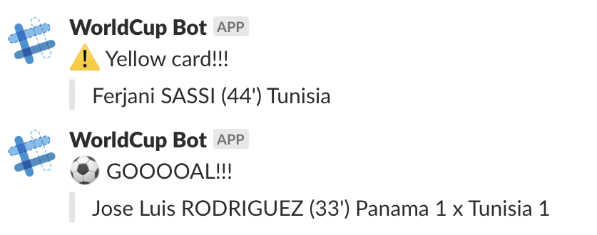

### WorldCup Bot

Meet WorldCup Bot, a dirty simple bot for posting 2018 FIFA World Cup Russia™ matches events to Slack.

WorldCup Bot will post:

* Today's matches
* Matches about to start
* Goals
* Yellow and red cards



### Getting started

Configure your AWS keys, [this article](https://serverless.com/framework/docs/providers/aws/guide/credentials/) shows various ways of configuring the keys. A quick simple one is just to export `AWS_ACCESS_KEY_ID` and `AWS_SECRET_ACCESS_KEY`. Personally, I prefer [aws-vault](https://github.com/99designs/aws-vault) for managing my keys.

Get a [Slack Token](https://api.slack.com/custom-integrations/legacy-tokens).

Create an `.env` file as follows:

```
SLACK_TOKEN=YOUR-SLACK-TOKEN
SLACK_CHANNEL=#worldcup
SLACK_BOT_NAME=WorldCup Bot
```

Install dependencies:

```sh
# See https://yarnpkg.com/lang/en/docs/install/
yarn install
```

Deploy:

```sh
yarn deploy
```

That's it, the WorldCup Bot will check and notify matches events every 1 minute. For changing the frequency or disabling the auto notification, check the [CloudWatch Event configuration](https://github.com/phstc/serverless-world-cup-slack-bot/blob/8ea969b5df65be1ce84d44a4544643ba4230d4b2/serverless.yml#L28-L29).

#### Invoking from command-line

For invoking the deployed version:

```sh
yarn sls invoke -f matches
```

For invoking the local version:

```sh
yarn sls invoke local -f matches
```

### AWS Resources

WorldCup Bot runs on [AWS](https://aws.amazon.com/) and it uses:

* [CloudFormation](https://aws.amazon.com/cloudformation/) provisioned with [Serverless](https://serverless.com)
* [Lambda](https://aws.amazon.com/lambda/) for processing matches data from [WORLD CUP 2018](https://worldcup.sfg.io/) and posting to Slack
* [CloudWatch Events](https://docs.aws.amazon.com/AmazonCloudWatch/latest/events/WhatIsCloudWatchEvents.html) for triggering the Lambda [every 1 minute](https://github.com/phstc/serverless-world-cup-slack-bot/blob/8ea969b5df65be1ce84d44a4544643ba4230d4b2/serverless.yml#L28)
* [DynamoDB](https://aws.amazon.com/dynamodb/) for keeping track of the sent messages to avoid duplicates

### Uninstall

Once you are done with your bot, you can just remove the CloudFormation stack `yarn sls remove`.
